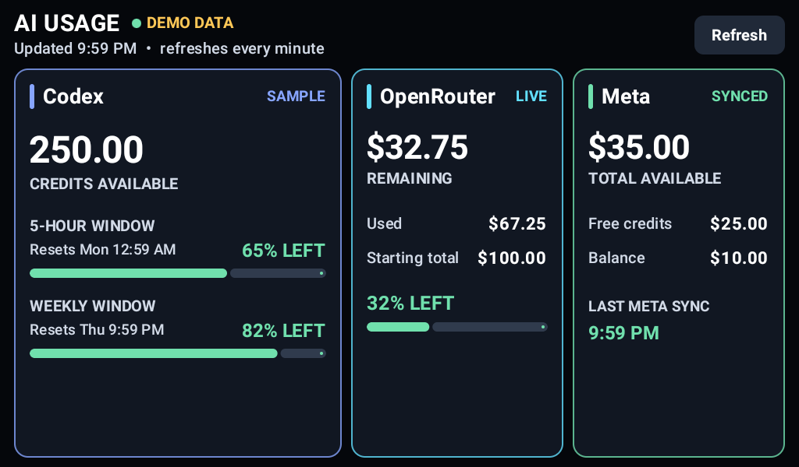

# AI Usage Monitor for Android

A high-contrast, always-on Android dashboard for viewing AI service quotas on a
single landscape screen. It was designed for low-density 1024x600 tablets, but
works on any Android 8.0+ device.



The screenshot uses synthetic demo values. No personal balances or account data
are included in this repository.

## Features

- Three side-by-side provider panels with large, readable typography
- Rolling usage windows, reset times, credit balances, and spend summaries
- Automatic refresh every minute and an on-demand refresh button
- Immersive edge-to-edge landscape mode with no scrolling
- Keeps the display awake while the dashboard is in the foreground
- Retains the last successful reading when a refresh fails
- Optional built-in demo mode for development and screenshots
- No analytics, advertising SDKs, or embedded credentials

## Requirements

- Android Studio or JDK 17 with the Android SDK
- Android SDK Platform 35
- An HTTPS JSON endpoint matching the schema below
- A device running Android 8.0 (API 26) or newer

## Configure

Copy the example configuration and edit it locally:

```bash
cp local.properties.example local.properties
```

```properties
sdk.dir=/path/to/Android/Sdk
USAGE_API_URL=https://example.com/api/v1/status
DEMO_MODE=false
```

`local.properties` is ignored by Git. The URL is compiled into the APK, so do not
put authentication tokens, passwords, or other secrets in it. Use an endpoint
that is intentionally safe for the app to read, or add proper Android-compatible
authentication before deployment.

For a build that uses synthetic data and makes no network request:

```bash
./gradlew assembleDebug -PdemoMode=true
```

## Expected response

The app reads only the documented display fields. Additional fields are ignored.

```json
{
  "fetched_at": "2026-01-01T12:00:00Z",
  "codex": {
    "ok": true,
    "plan_type": "example",
    "credits": {
      "balance": "250.00"
    },
    "primary_window": {
      "used_percent": 35,
      "reset_at": 1767276000
    },
    "secondary_window": {
      "used_percent": 18,
      "reset_at": 1767535200
    }
  },
  "openrouter": {
    "ok": true,
    "remaining": 32.75,
    "total_credits": 100.00,
    "total_usage": 67.25
  },
  "meta": {
    "remaining_balance": 10.00,
    "remaining_free_credits": 25.00,
    "currency": "USD",
    "updated_at": "2026-01-01T11:55:00Z"
  }
}
```

## Build and install

```bash
./gradlew assembleDebug
adb install -r app/build/outputs/apk/debug/app-debug.apk
```

The app forces landscape orientation and hides the system bars. Swipe from an
edge to reveal the transient Android navigation controls.

## Privacy and deployment notes

- Treat any unauthenticated endpoint as publicly readable.
- Return only the fields the dashboard needs. Do not include email addresses,
  user IDs, account IDs, access tokens, filesystem paths, or raw upstream API
  responses.
- The application does not persist API responses to disk.
- `FLAG_KEEP_SCREEN_ON` applies only while the app is visible. Pressing the power
  button or leaving the app returns control to the device's normal lock policy.

## License

MIT
